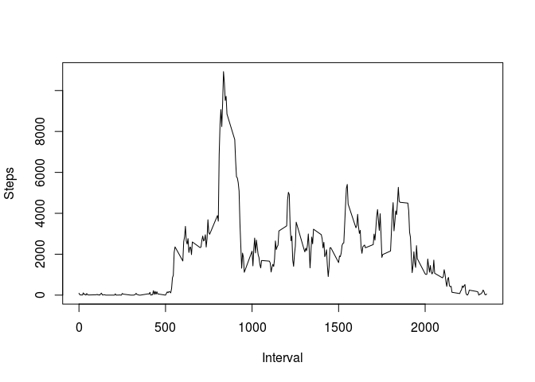
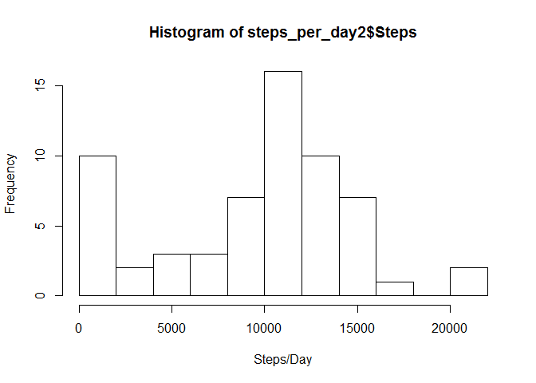
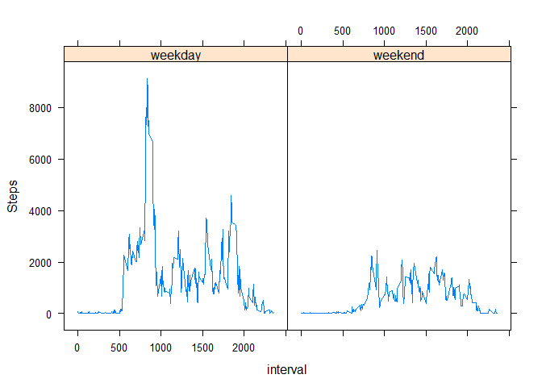

# Reproducible Research: Peer Assessment 1


## Loading and preprocessing the data
This code chunk loads the required libraries, reads the data from the .csv file and converts the date variable to class "Date".

```r
library(dplyr,quietly = T)
library(lubridate,quietly = T)
library(zoo,quietly = T)
library(lattice,quietly = T)
data <- read.csv(file="activity.csv")
data <- mutate(data,date=ymd(date))
```
## What is mean total number of steps taken per day?
First the data is grouped by date in order to use the summarise function to calculate the mean for each unique date. This data is used for the histogram. Subsequently the total mean and median are calculated. The data is plotted with the "plotly" package.

```r
by_date <- data %>% group_by(date)
steps_per_day <- by_date %>% summarise(Steps=sum(steps,na.rm=T))
hist(steps_per_day$Steps,xlab = "Steps/Day",breaks = 15)
```

<!-- -->

```r
mean_steps_per_day <- mean(steps_per_day$Steps,na.rm = T)
median_steps_per_day <- median(steps_per_day$Steps,na.rm = T)
cat(" The mean number of steps per day= ",mean_steps_per_day,"\n","The median number of steps per day= ",median_steps_per_day,"\n")
```

```
##  The mean number of steps per day=  9354.23 
##  The median number of steps per day=  10395
```
## What is the average daily activity pattern?
Similar to the previous code chunk, first the data is grouped by interval, then the mean for each unique interval value is calculated. The data is plotted with the "base" package.

```r
by_interval <- data %>% group_by(interval)
steps_per_int <- by_interval %>% summarise(Steps=sum(steps,na.rm=T))
plot(steps_per_int$interval,steps_per_int$Steps, type = "l",xlab = "Interval", ylab = "Steps")
```

<!-- -->

```r
max_interval <- steps_per_int$interval[which.max(steps_per_int$Steps)]
cat("The interval with the highest average step count= interval #",max_interval)
```

```
## The interval with the highest average step count= interval # 835
```
## Imputing missing values
the strategy used for imupting the missing data is to use linear interpolation. The approx function provides for linear interpolation and the "na.approx" function is a wrapper around "approx" from the package "zoo". Each missing value (or sequence of missing values) is interpolated between the previous valid sample and the next valid sample. Consequently, the strategy does not work for leading and trailing NA values in the dataset. These values are droped for the purpose of the analysis, since we are only reporting summary statistics. Replacing these values with the mean, median, etc. would not substantially change these summary statistics, but would reduce the variance (error of each statistic) slightly. The data is plotted with the "plotly" package.

```r
sum(!complete.cases(data))
```

```
## [1] 2304
```

```r
filled <-  na.approx(data$steps,1:17568, na.rm = F)
data2 <- mutate(data,steps=filled)
by_date2 <- data2 %>% group_by(date)
steps_per_day2 <- by_date2 %>% summarise(Steps=sum(steps,na.rm=T))
hist(steps_per_day2$Steps,xlab = "Steps/Day",breaks = 15)
```

<!-- -->

```r
mean_steps_per_day<- mean(steps_per_day2$Steps,na.rm = T)
median_steps_per_day<- median(steps_per_day2$Steps,na.rm = T)
cat(" The mean number of steps per day of the imputed dataset= ",mean_steps_per_day,"\n","The median number of steps per day of the imputed dataset= ",median_steps_per_day,"\n")
```

```
##  The mean number of steps per day of the imputed dataset=  9354.23 
##  The median number of steps per day of the imputed dataset=  10395
```

## Are there differences in activity patterns between weekdays and weekends?
Weekdays vs weekends are identified and stored as a factor variable. The imputed data is grouped by both interval and the factor "wkday". Finally the mean is calculated as above and the data is plotted using the lattice package.

```r
wkday <- (weekdays(data2$date)=="Saturday" | weekdays(data2$date)=="Sunday")
data2 <- data2 %>% mutate(wkday=factor(wkday,labels=c("weekday","weekend")))
by_interval_wkday <- data2 %>% group_by(interval,wkday)
steps_per_int2 <- by_interval_wkday %>% summarise(Steps=sum(steps,na.rm=T))
xyplot(Steps ~ interval | wkday, data = steps_per_int2, type="l")
```

<!-- -->
